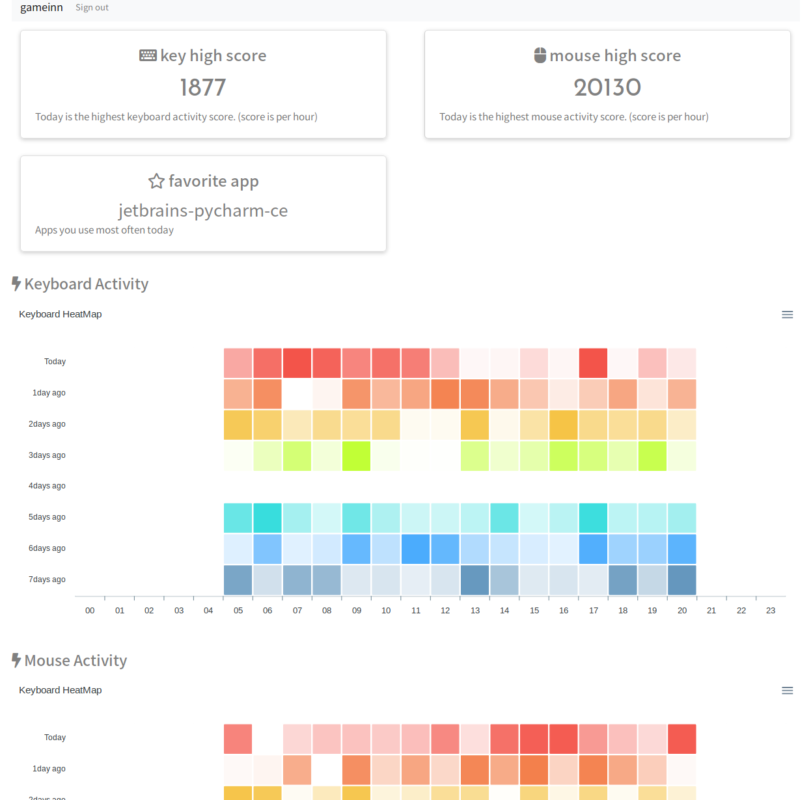

# gameinn

## About

* gameinn visualizes your keyboard and mouse activity.
* server and client is created by python.

 

## Enviroment

* ubuntu 18.04
  * apt install xdotool
* python 3.6
  * pip install -r requirements.txt

## How to use

**This product is still development. It can not run outside the above environment.**

### Start

```
cd gameinn

# create database (sqlite3)
python manage.py init_db

# run server
python server.py
```

1. Access ``localhost:5000`` after starting the server, and sign up your account.
1. Edit ``USER`` and ``PASS`` in ``client/gameinn.conf``. Enter the account information you registered.
1. Start gameinn_client.py. Over time, gameinn will visualize your keyboard and mouse activity from the collected data.

```
cd client

python gameinn_client.py
```

### Stop

```
# stop server
# Press CTRL+C at the terminal you started the server.

# stop client
cd client
./stop.sh
```

## To be implementated

* Write more unittests and Refactoring
* Support for other OS (Win10, macOS)

## Idea

* I want to apply it to gamification (activity battle)
* I want to apply it to recommendation system (App recommendations)